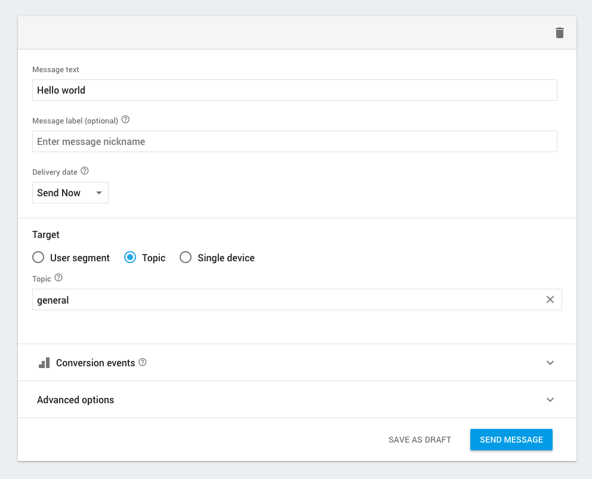

# iOS Push Notification using FCM

- Xcode 8.3
- Tested and works in iOS 9 and iOS 10

## What's this?
Code example for iOS using Firebase Cloud Messaging (FCM). In addition, we don't care about generated token since this code will utilize [Send Message to Topics](https://firebase.google.com/docs/cloud-messaging/ios/topic-messaging). 

This is very useful when we need to separate notification based on topics or group. Also, easier to manage user subsription.

## Really don't need the token?
Yes, it is handled by firebase (swizzling method). Therefore, any apps that subscribe to certain topic will surely get the notification (if server send to that topic). Easy right.

## Show me the iOS code..
The [AppDelegate](./AppDelegate.swift) here is created based on guide on FCM [site](https://firebase.google.com/docs/cloud-messaging/ios/client)

## How to test?

Firstly, you must follow steps to setup on firebase as stated on [their site](https://firebase.google.com/docs/cloud-messaging/ios/client)

In my example, initially, we are subsribed to "general" topic or you can specify your own topic. Try use postman with below HTTP POST request.

```
https://fcm.googleapis.com/fcm/send
Content-Type:application/json
Authorization:key=AIzaSyZ-1u...0GBYzPu7Udno5aA

{
  "to" : /topics/general",
  "priority" : "high",
  "notification" : {
    "body" : "This is a Firebase Cloud Messaging Topic Message!",
    "title" : "FCM Message",
  }
}
```

Another way, we can test from firebase console. 

- Go to [Console](https://console.firebase.google.com/)
- Select "Notifications" on the left sidebar
- Click on "NEW MESSAGE" button and you will get below form




## License
Licensed under the [MIT license](http://opensource.org/licenses/MIT)